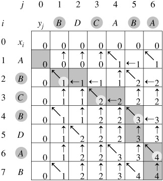

# 最长公共子序列 (LCS) 详解与算法实现

**Difficulty:** Medium
**Tags:** Dynamic Programming, String

## 1. LCS 定义

最长公共子序列，英文缩写为 LCS（Longest Common Subsequence）。其定义是，一个序列 S，如果分别是两个或多个已知序列的子序列，且是所有符合此条件序列中最长的，则 S 称为已知序列的最长公共子序列。



如果觉得抽象不好理解，那么咱们还是采用学习 LIS 的时候的方式。

*   **字符子串**：指的是字符串中连续的 n 个字符。如 `abcdefg` 中，`ab`，`cde` 属于子串。
*   **字符子序列**：指的是字符串中不一定连续但先后顺序一致的 n 个字符。如 `abcdefg` 中，`acdg`，`bdf` 属于子序列，而 `bac` 则不是。
*   **公共子序列**：如果序列 C 既是序列 A 的子序列，同时也是序列 B 的子序列，则称它为公共子序列。

**总结**：最长公共子序列（LCS）就是 A 和 B 的公共子序列中长度最长的。注意：LCS 不一定唯一，但长度是一定的。

## 2. LCS 长度求法 (动态规划)

暴力枚举复杂度高达 $2^{n+m}$，不可取。我们使用动态规划！

我们用 $LCS(x, y)$ 表示序列 $A$ 的前 $x$ 项和序列 $B$ 的前 $y$ 项的最长公共子序列长度。

**状态转移方程：**

1.  **若 $A_x == B_y$**：
    $$LCS(x, y) = LCS(x - 1, y - 1) + 1$$
    (说明当前的字符属于公共子序列的一部分)

2.  **若 $A_x \neq B_y$**：
    $$LCS(x, y) = \max(LCS(x - 1, y), LCS(x, y - 1))$$
    (说明当前字符不相等，继承之前最大的结果)

3.  **边界条件**：
    若 $x=0$ 或 $y=0$，则 $LCS(x, y) = 0$。

### 算法演示图表

[**动画演示**](https://algo.jsdiff.com/sequence/lcs/)

### 伪代码实现

```cpp
for x = 0 to n do
    for y = 0 to m do
        if (x == 0 || y == 0) then 
            LCS[x][y] = 0
        else if (A[x] == B[y]) then
            LCS[x][y] = LCS[x - 1][y - 1] + 1
        else 
            LCS[x][y] = max(LCS[x - 1][y], LCS[x][y - 1])
        endif
    endfor
endfor
```

## 3. LCS 经典例题模板

### 例1：Common Subsequence（求 LCS 长度）

给出两个序列 X 和 Y，找到 X 和 Y 的最大公共子序列长度。

**C++ 代码模板：**

```cpp
#include <iostream>
#include <cstring>
#include <algorithm>
using namespace std;

char a[1001], b[1001];
int dp[1001][1001], len1, len2;

void lcs() {
    for(int i=1; i<=len1; i++) {
        for(int j=1; j<=len2; j++) {
            if(a[i-1] == b[j-1])
                dp[i][j] = dp[i-1][j-1] + 1;
            else
                dp[i][j] = max(dp[i-1][j], dp[i][j-1]);
        }
    }
}

int main() {
    while(scanf("%s %s", a, b) != EOF) {
        memset(dp, 0, sizeof(dp));
        len1 = strlen(a);
        len2 = strlen(b);
        lcs();
        printf("%d\n", dp[len1][len2]);
    }
    return 0;
}
```

### 例2：输出具体的 LCS 序列

不仅要求长度，还要求输出具体字符串。我们需要通过 DP 表回溯。

**核心回溯逻辑：**

```cpp
// i, j 从 len1, len2 开始回溯
while(i!=0 && j!=0) {
    if(a[i-1] == b[j-1]) {
        c[z++] = a[--i]; // 找到公共字符，存入结果
        j--;
    }
    else if(dp[i-1][j] > dp[i][j-1]) {
        // 往大的方向回退
        i--;
    }
    else {
        j--;
    }
}
// 最后将 c 数组逆序输出
```

## 知识点总结

LCS 是动态规划的经典入门题。

* **时间复杂度**：$O(nm)$
* **空间复杂度**：$O(nm)$ (注：如果只求长度，使用滚动数组优化可降至 $O(\min(n,m))$)。